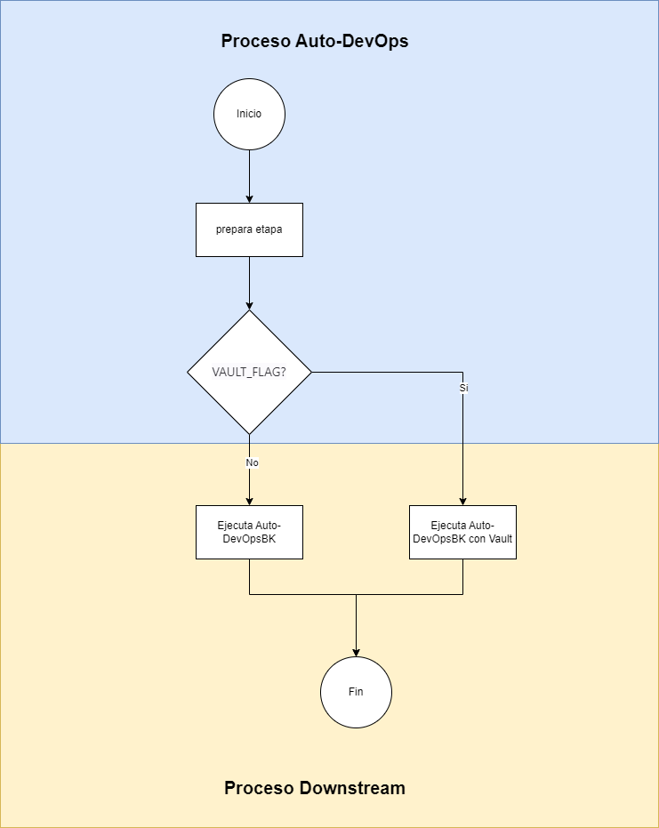

# Vault integration
Integracion GitLab - Vault
Se crea una etapa dinamica donde se valida que se tenga una valiable de entorno y se construya de manera automatica el archivo Auto-DevOps.gitlab-ci.yml con los variables que se obtendran del servidor de Vault

